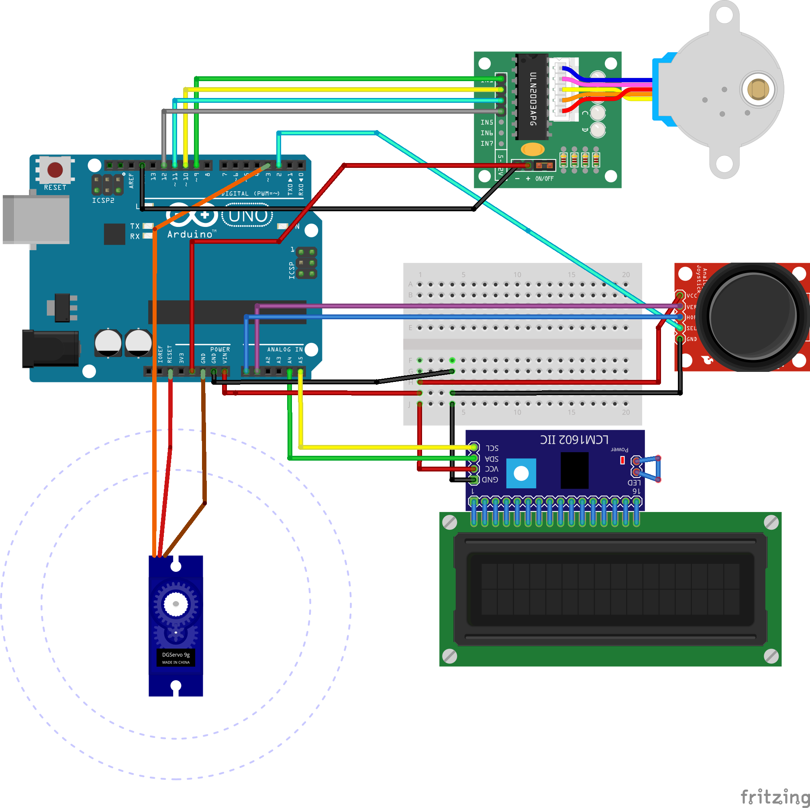

# 3d-scanner

 Turnable platform for taking photos. Suited for photogrammetry

This project is based from [3d scanner by Bribro12](https://www.thingiverse.com/thing:3958326).

## What is different

The program from original author was a little confusing so I wrote my own. Also, I added I2C Adapter for LCD screen.
Todo: The design has been changed a little, with a space for the I2C adapter and a snappable screen cover.

**Update 09.03.2024:** I decided to control the camera with a earphone cable. It is more convinient and easy to setup. So, the servo is not needed to build this project.

## Components

- Arduino UNO
- A jack cable from earphone
- 240 ohm resistor
- Joystick module
- LCD screen
- I2C adapter for LCD Screen
- Step Motor
- Step Motor Driver
- Small Breadboard
- Header Cables
- 3D Files are [here]()

## Schematics

TODO: Update The Schematics with jack cable

If you could'n configure the jack. [Here is a good guide for it](https://vervainglobal.com/articles/remote-shutter.html)  

## How it works and How to use

The platform will do a complete one turn. By dividing one turn by a number, we will get a portion. On each portion, the servo motor will be activated and it will press the button on the camera.

The dividing number can be adjusted by the joystick and it will shown on the screen. By choosing desired number and pressing the joystick button, the device will start the scanning and begin to slowly spin.

## Results

To do