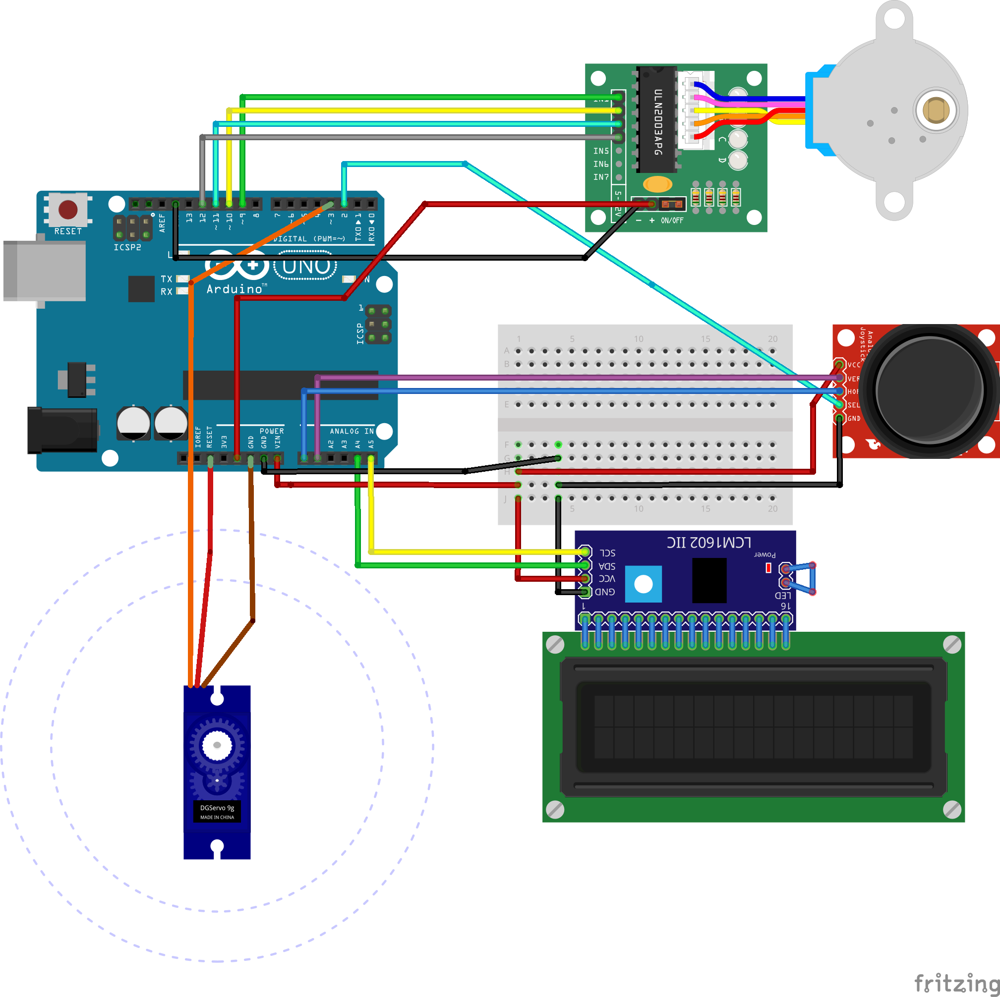

# 3d-scanner
 Turnable platform for taking photos. Suited for photogrammetry

This project is based from [3d scanner by Bribro12 ](https://www.thingiverse.com/thing:3958326).
# What is different

The program from original author was a little confusing so I wrote my own. Also, I added I2C Adapter for LCD screen. 
Todo: The design has been changed a little, with a space for the I2C adapter and a snappable screen cover.

# Components
- Arduino UNO
- 9g Servo Motor
- Joystick module
- LCD screen
- I2C adapter for LCD Screen
- Step Motor
- Step Motor Driver
- Small Breadboard
- Header Cables
- 3D Files are [here]()

# Schematics

# How it works and How to use

The platform will do a complete one tour. By dividing the tour by a number, we will get portions where weare able shutter the camera. On each portion, the servo motor will be activated and it will press the button on the camera.

The dividing number can be adjusted by the joystick and shown on the screen. By choosing desired number and pressing the joystick button, the device will start the scanning and begin to slowly spin.

(Recomended) By adding a height to the camera and doing the scanning again, it's achivable to get high quality 3d scans.

# Results

To do 

# Tips

- You can extend the servo cable by connecting extra header cables.
- It is recomended to use a tripod to easily adjust the height of the camera.